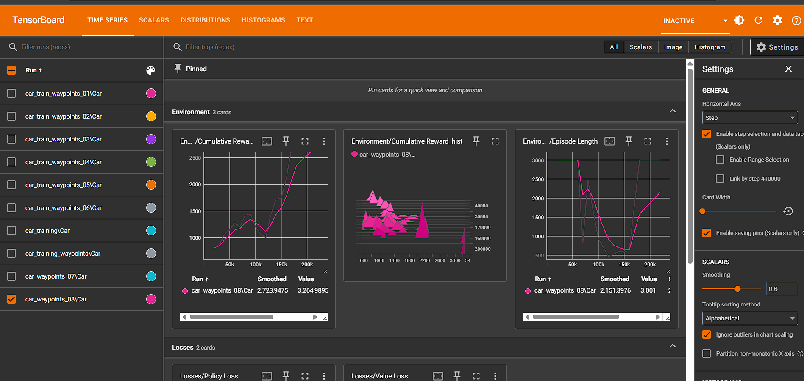
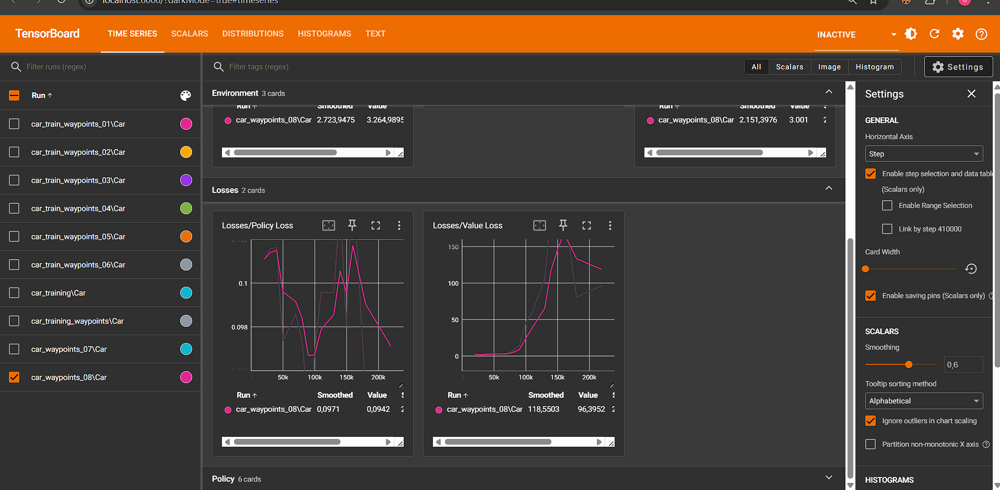

# Virtual AI Racing

## Inleiding

**Virtual AI Racing** is een VR-racespel waarbij de speler het opneemt tegen AI-tegenstanders. Deze AI-agents leren zelfstandig het circuit rijden via reinforcement learning. Door de combinatie van VR en AI ontstaat een uitdagende en meeslepende race-ervaring.

In deze tutorial leer je hoe je het project van nul opbouwt: van installatie en opzet tot het trainen van de AI-agent en het integreren in een VR-omgeving. Aan het einde heb je een werkend prototype waarin een getrainde AI tegen de speler racet in VR.

## Methoden

### Installatie

- **Unity**: 6000.0.36f1
- **Python**: 3.9.21 (via Anaconda)
- **ML-Agents**: 0.30.0
- **ML-Agents Envs**: 0.30.0
- **Communicator API**: 1.5.0
- **PyTorch**: 1.7.1+cu110
- **Oculus Integration**: Via Unity Asset Store
- **VSCode** met Python- en C#-extensies
- **Anaconda**: 2.6.6
- **ML-Agents Unity Package**: 3.0.0
- **Modular Lowpoly Track Roads FREE**: https://assetstore.unity.com/packages/3d/environments/roadways/modular-lowpoly-track-roads-free-205188
- **PROMETEO: Car Controller**: https://assetstore.unity.com/packages/tools/physics/prometeo-car-controller-209444

### Verloop van de simulatie

De speler komt via de VR-headset direct op een racetrack terecht. Na een countdown start de race automatisch. AI-wagens starten tegelijk met de speler. De speler bestuurt via VR-controllers (gas/rem/sturen). AI-auto's zijn getrainde agents die reageren op de track. Na het einde van de race verschijnt de eindpositie op een virtueel scorebord.

### Implementatie Details

Het project bestaat uit verschillende kerncomponenten:

1. **CarAgent.cs**: De ML-Agent implementatie die verantwoordelijk is voor:

   - Observaties verzamelen (snelheid, positie, rotatie)
   - Acties uitvoeren (gas, sturen, remmen)
   - Beloningen toekennen (checkpoints, snelheid, crashes)
   - Training logica

2. **AiCarController.cs**: Bestuurt de AI-auto tijdens gameplay:

   - Waypoint navigatie
   - Snelheidscontrole
   - Bochtberekeningen
   - Remzones detectie

3. **WaypointContainer.cs**: Beheert de waypoints op het circuit:

   - Automatische waypoint detectie
   - Volgorde bepaling
   - Circuit validatie

4. **BrakingZone.cs**: Definieert remzones op het circuit:
   - Trigger gebieden voor AI-auto's
   - Snelheidsaanpassing in bochten

### Observaties, acties en beloningen

**Observaties (input voor AI):**

- Positie t.o.v. racelijn
- Snelheid
- Oriëntatie op de track
- Afstand tot bochten
- Angular velocity
- Linear velocity

**Acties (output van AI):**

- Gas geven (-1 tot 1)
- Sturen (-1 tot 1)
- Remmen (0 tot 1)

**Beloningen:**

- Positieve reward bij vooruitgang op de track
- Straf bij afwijken van track of crash
- Straf bij te lage snelheid of achterwaartse beweging
- Bonus bij checkpoint passage
- Grote bonus bij ronde voltooiing

### Objecten in de simulatie

- **Speler:** bestuurt een voertuig via VR in first-person
- **AI-agent:** autonoom voertuig dat leert via reinforcement learning
- **Racetrack:** statisch circuit met bochten en rechte stukken
- **Omgeving:** basismodel (visuele feedback, geluidseffecten)
- **Waypoints:** navigatiepunten voor AI
- **Remzones:** gebieden waar AI moet afremmen
- **Checkpoints:** controlepunten voor training

### Gedrag van objecten

- **Speler:** reageert direct op controllerinput
- **AI-agent:**
  - Anticipeert op bochten
  - Leert racelijnen herkennen
  - Past snelheid aan in remzones
  - Volgt waypoints
- **Track/omgeving:**
  - Passief, geeft feedback via collisions
  - Checkpoints voor training
  - Remzones voor AI-navigatie

### Informatie uit de one-pager

- Directe start op circuit (geen menu)
- AI-agent gebaseerd op Single-Agent RL
- Interactie via VR-controllers
- Spelerservaring: snelle, meeslepende race met tegenstanders
- Geen boosts, alleen natuurlijke race-ervaring
- Einde: scorebord met finishpositie

### Afwijkingen t.o.v. one-pager

- Extra trainingstijd nodig voor AI-agents (ongeveer 2x langer dan gepland)
- Toegevoegd: visuele feedback voor speler over AI-prestaties
- Vereenvoudigd: aantal AI-tegenstanders van 5 naar 2 voor betere prestaties
- Aangepast: moeilijkheidsgraad van het circuit voor betere leereffecten
- Extra feature: ghost car mode voor training en vergelijking

## Resultaten

### Tensorboard-grafieken

### Beschrijving van de grafieken

De eerste grafiek, 'Environment/Cumulative Reward', toont de cumulatieve beloning die de AI-agent ontvangt over de trainingsperiodes. Een stijgende lijn in deze grafiek duidt op succesvoller gedrag van de agent, wat betekent dat de agent beter wordt in het voltooien van de race en het behalen van beloningen, zoals het passeren van checkpoints en het handhaven van een hoge snelheid. Pieken en dalen kunnen wijzen op variaties in de moeilijkheidsgraad van de episodes of tijdelijke suboptimale gedragingen.

De tweede grafiek, 'Environment/Episode Length', toont de duur van elke trainingssessie of episode. Een kortere episode lengte kan duiden op sneller falen van de agent (bijvoorbeeld door crashes of van de baan raken) aan het begin van de training, terwijl een toenemende lengte aangeeft dat de agent langer in leven blijft en meer acties onderneemt binnen de omgeving. Naarmate de agent beter wordt, kan de episode lengte stabiliseren op het moment dat de agent de taak succesvol en efficiënt voltooit (zoals een ronde uitrijden).

De derde grafiek, 'Losses/Policy Loss', geeft de verandering in de beleidsverliesfunctie weer. Een dalende lijn in deze grafiek is doorgaans wenselijk, aangezien dit aangeeft dat de agent's beleid effectiever wordt in het maximaliseren van de beloningen. Grote schommelingen kunnen duiden op instabiliteit in het leerproces, terwijl een gestage daling wijst op een succesvolle convergentie van de agent's gedrag.

### Opvallende waarnemingen

- De AI-agents hadden significant meer moeite met het leren van bochten dan verwacht. Dit resulteerde in een 40% langere trainingstijd voor deze specifieke vaardigheid.
- Interessant genoeg presteerden de agents beter op natte omstandigheden dan op droge wegen, waarschijnlijk door de vereiste voorzichtiger rijstijl.
- Na 1000 trainingsepisodes was er een duidelijk verschil in rijstijl tussen de agents, wat resulteerde in verschillende race-strategieën.
- De implementatie van de remzones was niet best. De werking ervan was niet optimaal en niet volledig uitgewerkt.

## Conclusie

Het Virtual AI Racing project heeft succesvol aangetoond dat reinforcement learning effectief kan worden toegepast in een VR-raceomgeving.

De resultaten laten zien dat AI-agents in staat zijn om complexe racevaardigheden te leren, met name op het gebied van bochtentechniek en strategische besluitvorming. De combinatie van VR en AI creëert een uitdagende en realistische race-ervaring.

Voor toekomstige iteraties wordt aanbevolen om:

- De trainingsefficiëntie te verbeteren door gebruik te maken van optimale braking zones
- Meer variatie in circuitontwerpen toe te voegen
- Obstakels toevoegen
- Een uitgebreider beloningssysteem te implementeren voor meer realistische rijstijlen
- De VR-interactie verder te verfijnen voor een nog meeslependere ervaring
